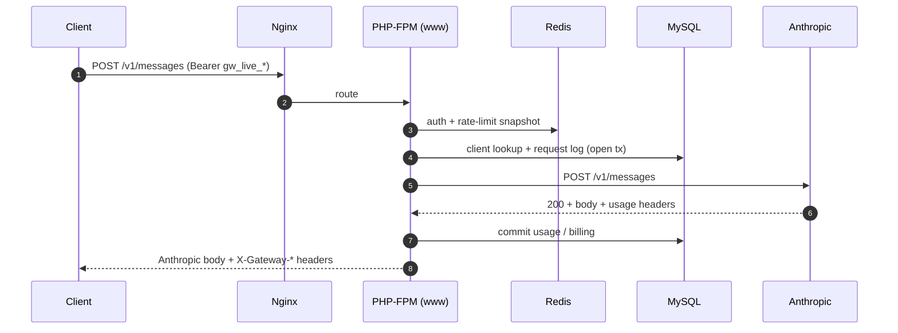
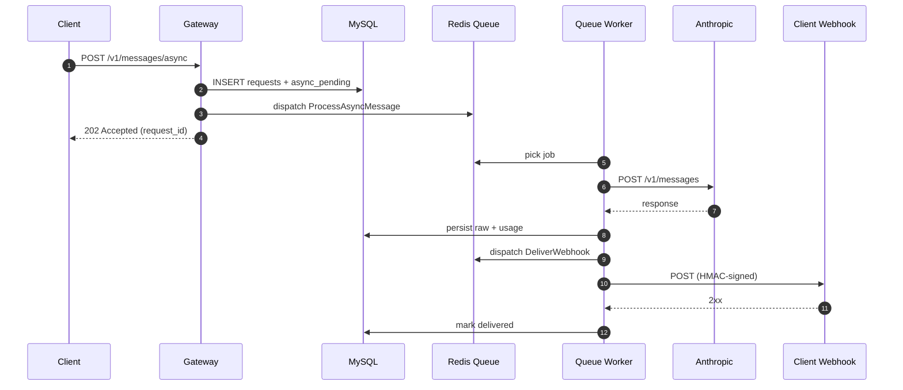

# LLM Gateway


Claude-only API gateway on top of the Anthropic Messages API. Honest pass-through plus a thin value-add layer: billing, rate-limiting, async webhooks, sessions with compaction, batch, MCP connector, skills and files.

## Why Claude-only

A multi-provider abstraction looks attractive on a slide and leaks value in production. Prompt caching, extended thinking, MCP, skills, server-side tools and file attachments are all provider-specific — wrapping them behind a lowest-common-denominator contract discards 60–80% of what the platform actually offers, and the resulting adapter code becomes a liability of its own.

The Claude-only choice is deliberate. One provider, passed through byte-for-byte, with the gateway adding only what belongs at the edge: authentication, quotas, audit, billing, webhook delivery with HMAC signatures, rate-limiting and observability. The request body sent to the client mirrors Anthropic's response; gateway metadata lives in `X-Gateway-*` headers and never pollutes the payload.

When a second provider becomes necessary, the plan is an additional gateway, not an abstraction layer. That keeps boundaries explicit and prevents the Claude-specific feature set from rotting into a subset of shared behaviour.

Reference: [Anthropic Messages API](https://docs.claude.com/en/api/messages). Full architectural rationale and trade-offs live in [documentation/decisions.md](documentation/decisions.md) ([ADR-001](documentation/decisions.md#adr-001-claude-only-gateway)).

## Quickstart

```bash
git clone https://github.com/Mikhail-Litvintsev/llm_gateway.git
cd llm_gateway
cp .env.example .env
# Fill in ANTHROPIC_API_KEY, API_KEY_PEPPER, CLAUDE_ADMIN_API_KEY before starting.
./start.sh
```

After startup:

- API: `http://localhost:8080/v1/messages`
- Health: `http://localhost:8080/internal/health`

Host ports: 8080 (HTTP), 3307 (MySQL), 6381 (Redis).

## Architecture

Synchronous request flow:



Async webhook flow:



## Endpoints

| Method | URL                         | Mode       | Description |
|--------|-----------------------------|------------|-------------|
| POST   | `/v1/messages`              | sync / SSE | Anthropic Messages pass-through; `stream: true` enables SSE. |
| POST   | `/v1/messages/async`        | async      | Returns 202; response is delivered to the client webhook. |
| POST   | `/v1/batches`               | batch      | Anthropic Messages Batches API plus accumulator mode. |
| GET    | `/v1/batches/{id}`          | batch      | Batch status. |
| GET    | `/v1/batches/{id}/results`  | batch      | NDJSON result stream. |
| POST   | `/v1/sessions`              | session    | Multi-turn session with compaction and context editing. |
| *      | `/v1/files/*`               | files      | File upload / list / fetch / delete. |
| *      | `/v1/skills/*`              | skills     | Skill manifest registration and lifecycle. |
| GET    | `/internal/health`          | ops        | Unauthenticated health probe. |

All `/v1/*` endpoints are protected by a per-client rate limit (HTTP 429 with `Retry-After` and `X-RateLimit-*` headers on exceed). See [Rate limiting](documentation/client_integration_guide.md#rate-limiting).

Full specification: [documentation/client_integration_guide.md](documentation/client_integration_guide.md).

Protocol compatibility: pass-through of the Anthropic Messages API. See [Deviations](documentation/client_integration_guide.md#deviations-from-anthropic-messages-api) for gateway-specific differences (auth, headers, additional endpoints, webhook envelope, error extensions). Architectural rationale: [documentation/decisions.md](documentation/decisions.md) ([ADR-001](documentation/decisions.md#adr-001-claude-only-gateway), [ADR-007](documentation/decisions.md#adr-007-no-openapi)).

## Testing

```bash
./start.sh
docker compose exec -T llm_gateway php artisan llm:create-test-db
docker compose exec -T llm_gateway php artisan test

# Unit suite only
docker compose exec -T llm_gateway php artisan test --testsuite=Unit
```

## Running integration tests

Integration tests hit the real Anthropic API and are opt-in. They are skipped by default.

### Prerequisites
- Set `ANTHROPIC_API_KEY_TEST` to a valid Anthropic API key with quota for `claude-haiku`.
- Set `INTEGRATION_ANTHROPIC=1`.
- Use a separate key from production — integration tests consume real tokens.

### Run

```bash
INTEGRATION_ANTHROPIC=1 ANTHROPIC_API_KEY_TEST=sk-ant-... \
    docker compose exec -T llm_gateway php artisan test --testsuite=Integration
```

### Scenarios covered
- `test_claude_status_command_reports_connected` — healthcheck ping.
- `test_count_tokens_live_returns_positive_integer` — `/count_tokens` on Haiku.
- `test_messages_live_haiku_minimal_roundtrip` — `/messages` sync on Haiku.
- `test_real_streaming_messages` — `/messages` with `stream: true` on Haiku.

### Cost
Each full run costs roughly $0.001 (Haiku, single-digit tokens per test). Safe to run in CI daily.

## Performance

Gateway overhead — the time the gateway spends between accepting a request and returning a response, excluding the upstream Anthropic call — measured with the k6 scenario at [`benchmarks/gateway-overhead.js`](benchmarks/gateway-overhead.js):

- p50 = **77 ms**
- p95 = **115 ms**
- p99 = **136 ms**

Method, environment, host specs and raw numbers: [`benchmarks/results.md`](benchmarks/results.md). End-to-end latency is dominated by the Anthropic response (typically 1–5+ seconds) and is outside the gateway's control — see [ADR-008](documentation/decisions.md#adr-008-p95-overhead-measurement-not-full-response-latency).

## Known limitations

- Laravel Horizon is intentionally not used. Queue monitoring is done through Artisan commands and the `failed_jobs` table (see [ADR-002](documentation/decisions.md#adr-002-no-horizon)).
- End-to-end p95 is dominated by Anthropic response latency (1–5+ seconds) and is outside the gateway's control. The published numbers above measure gateway overhead only.
- Async idempotency relies on a pre-call DB check; a narrow race window exists between the upstream HTTP response and the first `request_raw` insert. See [ADR-005](documentation/decisions.md#adr-005-no-idempotency-key-for-anthropic-messages-api).
- Webhook delivery: a 4xx response from the client endpoint is treated as a permanent failure and is not retried. The status list is configurable via `config/llm.php` → `webhook.permanent_fail_statuses` (defaults: `400, 401, 403, 404, 410, 413, 422`). Transient failures (5xx, network) follow the exponential-backoff retry curve up to `webhook.default_max_attempts`.

## AI-assisted development

This repository was built with Claude Code as an AI pair-programmer. The `CLAUDE.md` file at the root is intentionally committed — it contains the context and conventions the agent works against. Keeping it public is a deliberate signal about the development workflow rather than an oversight.

## Documentation

- [Client integration guide](documentation/client_integration_guide.md) — full API specification, auth, webhooks, idempotency.
- [Internal logic](documentation/internal_logic.md) — component layout and how to extend the gateway.
- [Operational runbook](documentation/operational_runbook.md) — on-call procedures, migrations, rollbacks.
- [Microservices setup](documentation/microservices_setup_guide.md) — deployment outside Docker Compose.
- [Commands](documentation/commands.md) — Artisan command reference.
- [Architectural decisions](documentation/decisions.md) — ADR-001…011: non-obvious choices and their trade-offs.
- [Benchmarks](benchmarks/readme.md) — gateway overhead measurement method and reproducible results.

## License

MIT
