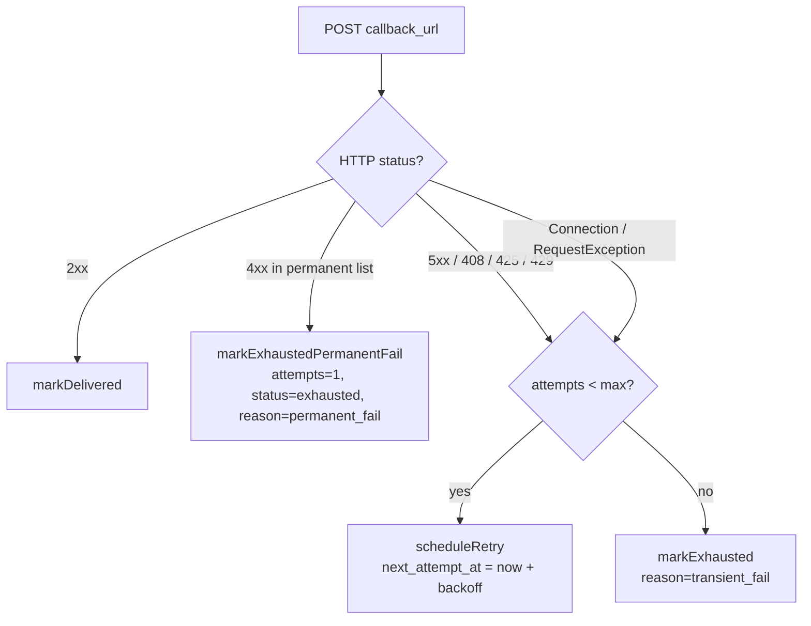
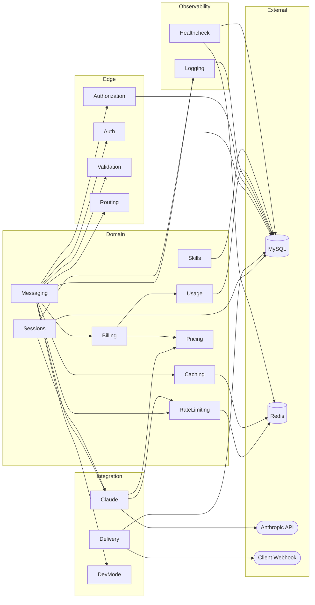

# LLM Gateway v4 -- Internal architecture and logic

This document targets a developer joining the team. It describes every component, data flow, configuration knob, and update procedure.

---

## 1. Architecture

The gateway accepts client requests, routes them to the Anthropic Messages API, and returns the result through one of four delivery modes.

### 1.1 Synchronous request (non-streaming)

```text
Client
  |
  v
POST /api/v1/messages
  |
  v
ApiKeyAuth middleware  -->  Auth::authenticate()
  |
  v
ClaudeRateLimitTracker::canProceed()
  |
  v
MessageRequestValidator::validate(ctx=Sync)
  |
  v
AutoCacheInjector::inject()
  |
  v
PayloadBuilder::build()
  |
  v
Claude::sendMessage()  -->  HTTP POST api.anthropic.com/v1/messages
  |
  v
ResponseParser::parseSuccess() / ErrorMapper::map()
  |
  v
CostCalculator::calculate()
  |
  v
Billing::recordSpend()
  |
  v
Logging::record()
  |
  v
HTTP 200 JSON response --> Client
```

### 1.2 Synchronous streaming request

```text
Client
  |
  v
POST /api/v1/messages  (stream: true)
  |
  v
ApiKeyAuth --> ClaudeRateLimitTracker --> MessageRequestValidator(ctx=SyncStream)
  |
  v
AutoCacheInjector --> PayloadBuilder::build()
  |
  v
Claude::streamMessage()
  |
  v
StreamResponder::stream()
  |                                     +-- StreamEventParser::consume()
  v                                     |   (inputTokens, outputTokens, stopReason)
SSE pass-through -->  Client            |
  |  (ignore_user_abort: upstream       |
  |   drain continues after disconnect) |
  v                                     v
message_stop / error              StreamAggregate
  |
  v
onComplete callback:
  CostCalculator::calculate()
  Billing::recordSpend()
  Logging::record()
  |
  v
HTTP response complete
```

### 1.3 Async webhook flow

```text
Client
  |
  v
POST /api/v1/messages/async
  |
  v
ApiKeyAuth --> ClaudeRateLimitTracker --> MessageRequestValidator(ctx=AsyncCallback)
  |
  v
INSERT requests (status=accepted)
INSERT async_pending (payload_for_anthropic, callback_url)
  |
  v
HTTP 202 { request_id } --> Client
  |
  v
ProcessAsyncMessage job (queue: default, tries=1, timeout=600s)
  |
  v
Caching::autoInject() --> PayloadBuilder::build()
  |
  v
Claude::sendMessage() --> HTTP POST api.anthropic.com/v1/messages
  |
  v
ResponseParser --> CostCalculator --> Billing::recordSpend()
  |
  v
Logging::updateAsyncRecord()
  |
  v
DeliverWebhook job (queue: default, tries=1, timeout=60s)
  |
  v
Webhook::buildSignedRequest()  -->  Signer::sign()
  |                                  HMAC-SHA256(timestamp.body, secret)
  v
HTTP POST callback_url  (X-Webhook-Signature, X-Webhook-Timestamp)
  |
  v
DeliverWebhook::attemptDelivery() classifies the response or exception
into one WebhookDeliveryOutcome (Success / PermanentFail / TransientFail)
```

`DeliverWebhook::attemptDelivery()` is the single point that maps every HTTP response and exception to one `WebhookDeliveryOutcome` value, and the outer `handle()` method drives the row state machine accordingly:

- `Success` (HTTP 2xx) -> `AsyncPendingRow::markDelivered`.
- `PermanentFail` (HTTP status in `config('llm.webhook.permanent_fail_statuses')` = `[400, 401, 403, 404, 410, 413, 422]`) -> mark exhausted on the first attempt with `reason=permanent_fail`. No retries.
- `TransientFail` (every other status: 5xx, 408, 425, 429, plus `ConnectionException` and `RequestException`) -> if `attempts < max_attempts` reschedule with exponential backoff (`scheduleRetry`); otherwise mark exhausted with `reason=transient_fail`.

When the row is marked exhausted, `requests.status` is set to `failed_callback_delivery`.



### 1.4 Batch (accumulator)

```text
Client (N requests)
  |
  v
POST /api/v1/messages/batch  (item payload)
  |
  v
ApiKeyAuth --> MessageRequestValidator(ctx=BatchItem)
  |
  v
BatchAccumulator::append()
  |
  v
Redis Lua script (append_and_maybe_trigger.lua)
  - RPUSH item JSON into bucket list
  - SADD custom_id into ids set
  - HINCRBY bytes into meta hash
  - Trigger checks: count >= 100 / bytes >= 50MB / age >= 300s
  |
  v
trigger? --> FlushBatchAccumulatorBucket job (queue: batch)
  |
  v
flush_bucket.lua --> RPOP all items
  |
  v
BatchPayloadBuilder --> Anthropic POST /v1/messages/batches
  |
  v
BatchPersister --> INSERT batch_records, batch_items
  |
  v
PollBatchesScheduled (cron: everyMinute)
  |
  v
GET /v1/messages/batches/{id}  --> status check
  |
  v
ended? --> FetchBatchResults job
  |
  v
BatchResultParser --> BatchResultApplier --> CostCalculator
  |
  v
BatchWebhookFanout
  - <= 100 items: granular webhook per item
  - >  100 items: aggregated webhook
```

### 1.5 C4 component graph

The diagram captures first-level dependencies between `app/Components/*`. The Edge layer accepts the request (auth/validation/routing), the Domain layer applies business rules (billing, rate-limit, caching), and the Integration layer interacts with external services. Observability (Logging/Healthcheck) is a cross-cutting layer.



The arrow `A -> B` means "A calls or reads B". The cluster boxes group components by layer but do not impose a "no cross-layer call" rule, e.g. `Messaging` -> `Claude` is a direct call, as expected. Snapshot: 2026-04-25. Latest changes: Phase 05 (extraction of the `Messaging` component).

---

## 2. Components

All business logic lives under `app/Components/{Section}/`. The main class of each section is the orchestrator-facade at the section root.

### 2.1 Auth (`app/Components/Auth/`)

API-key authentication.

- **Auth** -- facade. `authenticate(bearerToken)` extracts the `gw_live_*` key, hashes it through `KeyHasher`, looks up the `Client` row by `api_key_hash`.
- **ApiKeyAuth** -- Laravel middleware. Calls `Auth::authenticate()`, stores the resolved `Client` in `$request->attributes` under the key `auth.client`.
- **KeyHasher** -- SHA-256 hashing with the pepper from `config('llm.auth.api_key_pepper')`.
- **KeyGenerator** -- generates new API keys in the `gw_live_*` format.
- **Exceptions/AuthenticationException** -- HTTP 401.

Dependencies: `Client` model.
Used by: middleware `auth.api_key` on every `/api/v1/*` route.

#### Middleware chain for `/v1/*`

Every `/v1/*` route is wrapped in this middleware stack (declared in `routes/api.php`):

```text
auth.api_key            -> resolves Bearer token, sets request attribute auth.client (App\Models\Client)
throttle:api-client     -> per-client rate limit (Laravel RateLimiter::for('api-client'))
                          bucket key:  client:{id}
                          limit:       Client::rate_limit_rpm > 0 ? Client::rate_limit_rpm
                                       : config('llm.rate_limit.default_per_minute', 600)
                          on exceed:   429 with rate_limit_error body + Retry-After + X-RateLimit-* headers
controller              -> route handler
```

The rate-limiter registration lives in `app/Providers/AppServiceProvider.php` `boot()` -- `RateLimiter::for('api-client', ...)`. The closure reads the `auth.client` attribute that `ApiKeyAuth` published, returns `Limit::none()` for unauthenticated requests, otherwise returns `Limit::perMinute($limit)->by('client:'.$client->id)` with a custom 429 response body.

### 2.2 Authorization (`app/Components/Authorization/`)

Authorization: model gating, feature gating, spend cap.

- **Authorization** -- facade. `authorize(Client, modelAlias, featuresUsed)` returns `AuthorizationResult`.
- **DTO/AuthorizationResult** -- `allowed: bool`, `message`, `deniedFeature`.
- **Enums/AuthorizationDenialReason** -- `ModelNotAllowed`, `FeatureNotAllowed`, `MonthlySpendCapExceeded`.

Logic:
1. `checkModelWhitelist` -- `allowed_features['models']` (empty array = all allowed).
2. `checkFeatureWhitelist` -- per-feature check, `prompt_caching` and `citations` are allowed by default.
3. `checkSpendCap` -- `current_month_spend_usd >= monthly_spend_cap_usd`.

Dependencies: `Client` model.
Used by: `Sessions::create()`, `Sessions::sendSync()`, `ProcessAsyncMessage`.

### 2.3 Billing (`app/Components/Billing/`)

Per-client spend tracking with soft and hard cap.

- **Billing** -- facade. `preCheck(Client)` and `recordSpend(Client, costUsd)`.
- **UsageTracker** -- Redis counter for hard-cap enforcement. `reserve()`, `commit()`, `currentSpend()`. Key: `llm:billing:spend:{clientId}:{YYYY-MM}`, TTL until end of month + 1 hour.
- **CostEstimator** -- pre-flight cost estimate before the API call.
- **DTO/SpendPreCheckResult** -- `SpendGateDecision` (AllowedUnlimited, AllowedWithinCap, SoftCapExceeded, HardCapExceeded).
- **DTO/SpendRecordResult** -- `newTotalUsd`, `remainingUsd`, `capJustExceeded`.
- **Exceptions/HardCapExceededException**.

Dependencies: `Client` model, Redis.
Used by: `Claude::sendMessage()`, `Claude::streamMessage()`, `ProcessAsyncMessage`.

### 2.4 Caching (`app/Components/Caching/`)

Automatic injection of `cache_control` markers into the payload for prompt caching.

- **Caching** -- facade. `autoInject(payload, modelAlias, Client)`.
- **AutoCacheInjector** -- main logic. Checks `auto_cache_injection` in `allowed_features`, counts characters in the prefix (system + tools + every message except the last), estimates tokens through `estimation_chars_per_token` (3.5), and compares against the model minimum threshold.
- **DTO/CacheInjectionResult** -- `payload`, `outcome`, `estimatedPrefixTokens`.
- **Enums/CacheInjectionOutcome** -- `Injected`, `SkippedDisabled`, `SkippedAlreadyPresent`, `SkippedPrefixTooShort`, `SkippedCapExceeded`.

Minimum thresholds (tokens): opus=1024, sonnet=1024, haiku=2048.
For batch items: `injectForBatchItem()` selects the TTL (1h for batch when `auto_use_1h_cache_for_batch` is set, otherwise 5m).

Dependencies: `config('llm.claude.caching')`.
Used by: `ProcessAsyncMessage`, `MessagesController`.

### 2.5 Claude (`app/Components/Claude/`)

The central component: interaction with the Anthropic API.

- **Claude** -- top-level facade. `sendMessage()`, `streamMessage()`, `countTokens()`, `createBatch()`, `getBatch()`, `getBatchResults()`, `uploadFile()`, `deleteFile()`, `getFile()`, `listFiles()`.
- **ToolTypeCatalog** -- catalog of every server-tool type (web_search, web_fetch, code_execution, tool_search, memory, bash, text_editor, computer) with versioned identifiers.

**Sub-namespaces:**

**Payload/** -- request assembly for Anthropic:
- `PayloadBuilder` -- orchestrator: validation and payload assembly. See section 4.
- `Validators/*` -- input validators (`MaxTokensEnforcer`, `PrefillCompatibilityEnforcer`, `ThinkingValidator`, `CitationsStructuredOutputEnforcer`, `ServiceTierGuard`, `InferenceGeoGuard`).
- `Normalisers/*` -- shape normalisers (`ToolNormaliser`, `MessageContentNormaliser`).
- `FileSourceResolver` -- resolves `file` source blocks through `FilesRepository`.
- `FeatureDetector`, `PayloadInspector` -- helpers for beta-feature detection and payload introspection.
- `DTO/BuiltPayload` -- result: `jsonBody`, `betaHeaders`, `modelSnapshot`, `modelAlias`, `serverToolTypes`.

**Response/** -- response parsing:
- `ResponseParser` -- parses content blocks, usage, citations, MCP tool uses, compaction detection. See section 5.

**Errors/**:
- `ErrorMapper` -- maps Anthropic HTTP errors into the gateway error format.

**Beta/**:
- `BetaHeaderRegistry` -- registry of feature -> beta header strings. See section 18.

**Batch/** -- batch subsystem:
- `BatchAccumulator` (in `Accumulator/`) -- Redis accumulator with Lua scripts.
- `BatchPayloadBuilder`, `BatchPreValidator`, `BatchPersister`.
- `BatchResultParser`, `BatchResultApplier`, `BatchResultsStreamer`.
- `BatchWebhookFanout`, `BatchCanceler`, `BatchCacheMetrics`.
- See section 9.

**Files/** -- file subsystem:
- `FilesUploadHandler`, `FilesDeletionHandler`, `FilesRepository`.
- `FilesUsageIndex`, `FilesCleanupRunner`, `FileUploadValidator`.
- `FilePurpose` enum.
- See section 10.

**DTO/**:
- `MessageRequest`, `MessageResponse`, `SendMessageInput`, `SendMessageOutput`.
- `UsageData`, `Batch`, `BatchCreateRequest`, `BatchItemInput`, `ResultLine`.
- `ClaudeFile`, `ModelInfo`, `StreamEvent`, `ThinkingSpec`, `TokenCountResult`.
- `ContextManagementConfig`, `McpServerConfig`.

**Enums/**:
- `BatchStatus`, `BatchItemStatus`, `ThinkingMode`, `ServerToolFeature`.

Dependencies: `Routing`, `Pricing`, `Billing`, `RateLimiting`, `Logging`, `Delivery`.
Used by: controllers, `ProcessAsyncMessage`, `Sessions`.

### 2.6 Delivery (`app/Components/Delivery/`)

Three response-delivery sub-components.

**Stream/** -- SSE streaming:
- `StreamResponder` -- opens an SSE connection to Anthropic, relays the stream to the client, and handles disconnects.
- `StreamEventParser` -- state machine for SSE events (message_start, message_delta, message_stop, content_block_*, error, ping).
- `DTO/StreamAggregate` -- accumulated metrics: tokens, stopReason, serviceTier.
- `DTO/StreamContext` -- input parameters for the stream.
- `DTO/StreamOutcome` -- result: cost, latency, disconnect status.
- `Enums/StreamEventType`.

**Sync/** -- synchronous responses:
- `SyncResponder`.
- `DTO/AnthropicResponseEnvelope` -- `httpStatusCode`, `rawBody`, `anthropicHeaders`.
- `DTO/GatewayHeaders` -- X-Gateway-* headers.

**Webhook/** -- webhook delivery:
- `Webhook` -- facade. `buildSignedRequest(Client, WebhookEnvelope)`.
- `Signer` -- HMAC-SHA256 signing. Supports secret rotation with a grace period.
- `DTO/WebhookEnvelope` -- envelope with `requestId`, `event`, `anthropicResponse`, `error`, `billing`.
- `DTO/SignedRequest` -- body + headers (X-Webhook-Signature, X-Webhook-Timestamp).
- `Enums/WebhookEvent` -- `message.completed`, `message.failed`.
- `Enums/WebhookDeliveryOutcome` -- `Success`, `PermanentFail`, `TransientFail`. Each delivery attempt is reduced to exactly one of these three values; `DeliverWebhook::attemptDelivery()` is the single point that performs the mapping (HTTP status -> success/permanent/transient, network or `RequestException` -> transient). The outer job uses the value to drive the `async_pending` state machine: `Success` -> `markDelivered`; `PermanentFail` -> `markExhaustedPermanentFail` after the first attempt with `reason=permanent_fail`; `TransientFail` -> `scheduleRetry` until `max_attempts`, then `markExhausted` with `reason=transient_fail`.
- `Exceptions/SecretUnavailableException`.

Dependencies: `Routing`, `Pricing`, `RateLimiting`.
Used by: `Claude::streamMessage()`, `DeliverWebhook` job.

### 2.7 DevMode (`app/Components/DevMode/`)

Stub responses for testing without real Anthropic API calls.

- **DevMode** -- facade. `stub(MessageRequest, Client)`, `stubStream(MessageRequest, Client)`.
- **DevModeStubber** -- generates fake responses. Configuration: `latency_ms`, `content`, `simulate_cache_hit_rate`. Supports thinking blocks, web_search results, tool_use.
- **DTO/StubbedResponse** -- `body`, `headers`, `usage`.

Activation: `dev_mode` flag on the `Client` model.
Config: `config('llm.dev_mode')`.

### 2.8 Healthcheck (`app/Components/Healthcheck/`)

System health monitoring.

- **Healthcheck** -- facade. `report()` returns a `HealthReport`.
- **DTO/HealthReport** -- `overall`, `components` (db, redis, anthropic), `anthropicLastCheckAt`.
- **Enums/HealthStatus** -- `Ok`, `Degraded`, `Down`.

Probes:
1. **db** -- `SELECT 1` with latency measurement.
2. **redis** -- `PING` on the `cache` connection.
3. **anthropic** -- cached result from the Redis key `claude:healthcheck:anthropic`, written by the `ClaudeApiPingScheduled` job.

Used by: `GET /internal/health`.

### 2.9 Logging (`app/Components/Logging/`)

Audit log of every request.

- **Logging** -- facade. `record(LoggingRecord)` -- atomic write to `requests`, `request_usage`, `request_raw` in a single transaction. `updateAsyncRecord()` for async flows.
- **PayloadMasker** -- recursive masking of fields that contain `oauth`, `token`, `secret`, `api_key`, `authorization`.
- **CapabilityDriftLogger** -- logs drift in model capabilities.
- **DTO/LoggingRecord** -- every column for the three tables.
- **DTO/LoggingResult** -- `requestId`.
- **Enums/Endpoint** -- `Messages`, ...
- **Enums/Mode** -- `Sync`, `SyncStream`, `AsyncCallback`, ...
- **Enums/RequestStatus** -- `Accepted`, `InProgress`, `Completed`, `CompletedDisconnected`, `FailedClientError`, `FailedServerError`, `FailedCallbackDelivery`.
- **Exceptions/IdempotencyException** -- raised on duplicate `request_id` (MySQL error 1062).

Dependencies: MySQL.
Used by: `Claude::sendMessage()`, `Claude::streamMessage()`, `ProcessAsyncMessage`.

### 2.10 Pricing (`app/Components/Pricing/`)

Cost calculation for requests.

- **Pricing** -- facade. `calculate(UsageData, modelAlias, isBatched, geoUs)`.
- **CostCalculator** -- main calculator. bcmath arithmetic with 12-digit precision. See section 12.
- **ServerToolPricing** -- server-tool pricing (web_search per 1k, code_execution per hour).
- **CodeExecutionUsageTracker** -- tracks free code_execution hours (1550 per month).
- **DTO/CostBreakdown** -- `inputCost`, `outputCost`, `cacheWrite5mCost`, `cacheWrite1hCost`, `cacheReadCost`, `serverToolWebSearchCost`, `serverToolCodeExecCost`, `geoMultiplierApplied`, `totalCost`.
- **DTO/Money** -- value object for monetary amounts (string-based bcmath).
- **DTO/CodeExecutionConsumption**.
- **Exceptions/UnknownPricingTierException**.

Dependencies: `config('llm.claude.pricing')`.
Used by: `Claude`, `StreamResponder`, `ProcessAsyncMessage`, `BatchResultApplier`.

### 2.11 RateLimiting (`app/Components/RateLimiting/`)

Local rate limiting derived from Anthropic response headers.

- **ClaudeRateLimitTracker** -- `canProceed()` checks the budget before the call, `recordFromHeaders()` updates the snapshot from the response. Supports namespaces: Messages, BatchCreate, Priority, Fast.
- **RateLimitHeaderParser** -- parses `anthropic-ratelimit-*` headers.
- **RateLimitNamespace** -- enum: `Messages`, `BatchCreate`, `Priority`, `Fast`.
- **DTO/RateLimitSnapshot** -- `requestsLimit/Remaining/ResetAt`, `inputTokensLimit/Remaining/ResetAt`, `outputTokensLimit/Remaining/ResetAt`.
- **Exceptions/RateLimitExceededException** -- HTTP 429 with `Retry-After`.

Storage: Redis, key `claude_rl:{namespace}:{workspaceKeyHash}:{modelSnapshot}`, TTL until reset + 5 seconds.
Safety margin: `config('llm.claude.rate_limit.safety_margin_pct')` (10%).

Dependencies: Redis.
Used by: `Claude::sendMessage()`, `Claude::countTokens()`, `StreamResponder`.

### 2.12 Routing (`app/Components/Routing/`)

Model and workspace resolution.

- **Routing** -- facade. `resolveModel(alias)`, `resolveWorkspace(Client)`.
- **ModelResolver** -- alias -> snapshot through `config('llm.claude.model_aliases')`. Cached in Laravel Cache for 1 hour. `getCapabilities()` with optional live-fetch from the Anthropic API.
- **ModelCapabilitiesFetcher** -- HTTP GET `/v1/models/{snapshot}` for live capabilities. The result is cached in Redis under `claude:caps:{snapshot}` for 1 hour.
- **WorkspaceResolver** -- client -> workspace -> decryptedApiKey. Model `ClaudeWorkspace`. Also `resolveDefault()` for system operations.
- **DTO/ResolvedModel** -- `alias`, `snapshot`, `capabilities`, `pricing`.
- **DTO/ResolvedWorkspace** -- `workspaceId`, `name`, `apiKey`, `anthropicWorkspaceId`.
- **DTO/ModelCapabilities**.
- **Exceptions/UnknownModelAliasException**, **WorkspaceNotConfiguredException**.

Dependencies: `ClaudeWorkspace` model, config.
Used by: `PayloadBuilder`, `Claude`, `BatchAccumulator`, `Sessions`.

### 2.13 Sessions (`app/Components/Sessions/`)

Multi-turn sessions with persistent history.

- **Sessions** -- facade (implements `SessionsContract`). `create()`, `sendSync()`, `sendStream()`, `getMetadata()`, `paginateHistory()`, `delete()`.
- **SessionStore** -- CRUD for sessions and messages. `appendUserMessage()`, `appendAssistantMessage()`, `loadFullHistory()`, `markCompacted()`, `decryptMcpTokens()`.
- **MemoryHandler** -- executes memory-tool commands: view, create, str_replace, insert, delete, rename. Files are stored in `SessionMemoryFile`.
- **Memory/MemoryPathValidator** -- validates `/memories/*` paths.
- **Contracts/SessionsContract**, **SessionStoreContract**.
- **DTO/** -- `SessionCreateInput`, `SessionMetadata`, `SessionHistoryPage`, `SessionSendMessageInput`, `SessionSendMessageResult`, `MemoryCommandResult`.
- **Enums/SessionStatus**, **MemoryCommand** (view, create, str_replace, insert, delete, rename).
- **Exceptions/** -- `SessionNotFoundException`, `SessionExpiredException`, `MemoryFileNotFoundException`, `MemoryFileExistsException`, `MemoryPathException`.

See section 8.

Dependencies: `Claude`, `PayloadBuilder`, `ResponseParser`, `Authorization`, `Validation`, `WorkspaceResolver`, `ModelResolver`.
Used by: `SessionsController`.

### 2.14 Skills (`app/Components/Skills/`)

Skills management (prebuilt tools for code_execution).

- **SkillsOrchestrator** -- facade. `createPrebuilt()`, `listForClient()`, `findBySkillId()`, `delete()`.
- **EloquentSkillsRepository** -- Eloquent-backed `SkillsRepository` (`ClientSkill` model).
- **Contracts/SkillsRepository**.
- **DTO/SkillDescriptor**.
- **Enums/PrebuiltSkill** -- `xlsx`, `docx`, `pptx`, `pdf`.

Requires `skills` in the client `allowed_features`. Prebuilt skills are defined in `config('llm.claude.skills.prebuilt')`.
Used by: `SkillsController`.

### 2.15 Usage (`app/Components/Usage/`)

Usage reports through the Anthropic Usage API.

- **UsageReportOrchestrator** -- facade. `getUsage(Client, queryParams)`.
- **UsageReportFetcher** -- HTTP GET to `config('llm.claude.endpoints.usage_report')`.
- **DTO/UsageReportRequest** -- `startingAt`, `endingAt`, `bucketWidth`, `workspaceId`, `limit`, `page`.

Requires `usage_api` in `allowed_features` and an `anthropic_workspace_id` on the client.
Used by: `ClientUsageController`.

### 2.16 Validation (`app/Components/Validation/`)

Validation of incoming requests.

- **Validation** -- facade (when needed).
- **MessageRequestValidator** -- main validator. See section 3.
- **ValidationContext** enum -- `Sync`, `SyncStream`, `AsyncCallback`, `BatchItem`, `Session`, `CountTokens`.
- **Rules/** -- semantic rules:
  - `ThinkingCompatibilityRule` -- thinking vs temperature/tool_choice.
  - `CitationsConsistencyRule` -- citations vs structured output.
  - `ServerFeaturesRule` -- server-feature checks.
  - `SearchResultBlockRule` -- search_result block validation.
  - `MemoryModelGateRule` -- memory tool only on supported models.
  - `PtcContractRule` -- PTC (Parallel Tool Calling) constraints.
- **Schemas/** -- JSON Schema files: `message_request.json`, `batch_item.json`.
- **DTO/ValidationResult**, **ValidationError**.
- **Enums/ServiceTier** -- `standard_only`, `auto`.
- **Enums/Speed** -- `normal`, `fast`.
- **Exceptions/** -- `ValidationException`, `FeatureNotAllowedException`, `FeatureQuotaExhaustedException`.

Dependencies: `opis/json-schema`, config.
Used by: controllers, `Sessions`, `ProcessAsyncMessage`.

---

## 3. Validation pipeline

`MessageRequestValidator::validate()` runs four stages:

1. **preCheck** -- presence of `messages` and `model`, alias check against `config('llm.claude.model_aliases')`.

2. **schemaCheck** -- JSON Schema validation through `opis/json-schema`. Schemas: `Schemas/message_request.json` (sync/async/session/count_tokens) and `Schemas/batch_item.json` (batch items).

3. **contextRulesCheck** -- rules tied to the calling context:
   - `forbid_stream` -- `stream=true` is rejected for batch_item and count_tokens.
   - `require_stream` -- `stream=true` is required for sync_stream.
   - `use_max_output_batch` -- `max_tokens` is checked against the `max_output_batch` capability.
   - `thinking.budget_tokens` vs `max_output`.
   - Opus prefill ban (`supports_prefill=false`).

4. **phase4Rules** -- business rules:
   - `ServiceTier` -- value validation, `priority_tier` allowed-feature check for `auto`.
   - `inference_geo` -- value must be in `config('llm.claude.inference_geo.allowed')`.
   - `Speed` -- fast mode requires the `fast_mode` feature, the `supports_fast_mode` capability, and is incompatible with batch and priority.
   - `mcp_servers` -- requires the `mcp_connector` feature.
   - `skills` -- requires the `skills` feature plus a `code_execution` tool.
   - `MemoryModelGateRule` -- memory tool on compatible models only.
   - `SearchResultBlockRule` -- search_result block structure.
   - `CitationsConsistencyRule` -- citations vs structured output.
   - `ThinkingCompatibilityRule` -- thinking constraints.
   - `PtcContractRule` -- PTC constraints.

5. **semanticCheck** -- a user message that follows a tool_use must contain only tool_result blocks.

To add a new rule: create a class in `Rules/` with `check(array $payload): ?ValidationError`, then call it from `phase4Rules()`.

---

## 4. PayloadBuilder

`PayloadBuilder::build()` lives in `app/Components/Claude/Payload/PayloadBuilder.php` and transforms a validated payload into the Anthropic API format.

After the `refactor(payload-builder): decompose into validators and normalisers` change, `PayloadBuilder` is a thin orchestrator. It delegates to two sibling sub-namespaces inside `app/Components/Claude/Payload/`:

- `Validators/` -- input validation and enforcement:
  - `MaxTokensEnforcer` -- caps `max_tokens` to model `max_output`.
  - `PrefillCompatibilityEnforcer` -- last message role=assistant only when `supports_prefill=true`.
  - `ThinkingValidator` -- adaptive (requires `supports_adaptive_thinking`, effort in low/medium/high), manual (`budget_tokens > 0`, `< max_tokens` on models without adaptive).
  - `CitationsStructuredOutputEnforcer` -- mutually exclusive features.
  - `ServiceTierGuard` -- priority requires the `priority_tier` feature.
  - `InferenceGeoGuard` -- geo override requires the feature.
- `Normalisers/` -- shape normalisation of the outgoing payload:
  - `MessageContentNormaliser` -- normalises message content blocks; search_result blocks are checked for required keys (title, source, content).
  - `ToolNormaliser` -- normalises server tools (web_search, web_fetch, code_execution, tool_search, memory, bash, text_editor, computer) separately; custom tools are checked for PTC (allowed_callers); custom tool limit is 128 (or 10000 with tool_search).

Helpers in the same namespace: `FeatureDetector` (drives beta-header detection) and `PayloadInspector` (read-only payload introspection).

Stages, in order:

1. **Model resolution** -- `ModelResolver::resolve(alias)` -> snapshot (e.g. `claude-sonnet-4-6`).

2. **Validators run** -- the validator classes listed above are invoked in turn through the orchestrator.

3. **Sampling-with-thinking checks** -- when thinking is enabled: `top_p` in `[0.95, 1.0]`, `tool_choice` only `auto` or `none`.

4. **Payload assembly** -- `assemblePayload()`: model -> snapshot, plus system, temperature (only without thinking), top_p, top_k, stop_sequences, tools, tool_choice, thinking, output_config, cache_control, service_tier, metadata, inference_geo, speed, skills, mcp_servers, stream.

5. **Message normalisation** -- `MessageContentNormaliser`.

6. **File source and vision resolution** -- `resolveFileSourcesInMessages()`: a `source.type=file` block is routed through `FileSourceResolver` which maps the gateway file id to the Anthropic file id. Vision (image content blocks with base64/url/file_id source) is handled natively by the Anthropic API, no transformation needed.

7. **Tool normalisation** -- `ToolNormaliser`.

8. **Context management** -- compaction, clear_tool_uses, clear_thinking.

9. **Beta headers** -- `FeatureDetector` + `BetaHeaderRegistry::collectBetaHeaders()`. Mapping feature -> header through `betaHeaderMap` (injected from `config('llm.claude.beta_headers')`).

10. **Serialisation** -- JSON encode, 32MB size check.

Result: `BuiltPayload` with `jsonBody`, `betaHeaders`, `modelSnapshot`, `modelAlias`, `serverToolTypes`, `warnings`.

---

## 5. ResponseParser

`ResponseParser` lives in `app/Components/Claude/Response/ResponseParser.php`.

### parseMessageResponse()

Full response parsing for the sync flow:

- **Content blocks** -- supported types:
  - `text` -- text block, may include `citations`.
  - `thinking` -- extended thinking, the `signature` key is checked.
  - `redacted_thinking` -- hidden thinking.
  - `compaction` -- context-compaction marker.
  - `tool_use` -- custom tool call.
  - `server_tool_use` -- server tool call.
  - `document`, `search_result` -- documents and search results.
  - `web_search_tool_result`, `web_fetch_tool_result`, `code_execution_tool_result` and other `*_tool_result` blocks.

- **MCP tagging** -- a `tool_use` whose name contains `__` is annotated with `mcp_server_name`.
- **Compaction detection** -- driven by the presence of a compaction block or a non-empty `usage.iterations`.
- **Memory tool uses** -- collection of tool_use blocks with the memory type.
- **Citations** -- extracted from text/document/search_result blocks.
- **Server tool use counts** -- from `usage.server_tool_use`.
- **Warnings** -- unknown stop_reason, unknown block type, thinking without signature.

### extractUsageData()

- `input_tokens`, `output_tokens`.
- `cache_creation_input_tokens_breakdown` -- broken down by TTL (5m, 1h).
- `cache_read_input_tokens`.
- `thinking_tokens`.
- `server_tool_use` counts (web_search, web_fetch, code_execution, tool_search).
- `iterations` -- token totals across every iteration (agentic loops).

### Stop reasons

Known values: `end_turn`, `max_tokens`, `tool_use`, `pause_turn`, `refusal`, `model_context_window_exceeded`.

---

## 6. Streaming

### StreamResponder

`app/Components/Delivery/Stream/StreamResponder.php` -- SSE pass-through.

Mechanism:
1. `ignore_user_abort(true)` -- the stream is not interrupted when the client disconnects.
2. HTTP POST to Anthropic with `stream: true` and the `read_timeout` from config.
3. Byte-level read from the Guzzle PSR-7 body (8192-byte chunks).
4. If the client is connected, `echo` the chunk and `flush`.
5. SSE events are separated by `\n\n`. Each event is parsed with `splitSseEvent()` into `eventName` + `dataJson`.
6. `StreamEventParser::consume()` accumulates tokens, stop_reason, errors.
7. Periodic disconnect check: `connection_aborted()` every N events (`disconnect_check_interval`).
8. On disconnect, drain the upstream until `message_stop` or `error` so usage is counted correctly.
9. On completion, the `onComplete` callback fires with a `StreamOutcome` for billing and logging.

### StreamEventParser

State machine, handles:
- `message_start` -- input_tokens, cache tokens, service_tier.
- `message_delta` -- output_tokens, stop_reason.
- `message_stop` -- completed=true.
- `error` -- errored=true, error type.
- `content_block_start/delta/stop`, `ping` -- ignored for billing.

### Error after 200

Anthropic can emit an `error` event after HTTP 200 (streaming has already started). `StreamEventParser` catches it through `handleError()`, `StreamOutcome.errorType` becomes `stream_error`. Billing is skipped when `!outcome.completed`.

### Response headers

```http
Content-Type: text/event-stream
Cache-Control: no-cache, no-transform
Connection: keep-alive
X-Accel-Buffering: no
X-Gateway-Request-Id: {gatewayRequestId}
X-Gateway-Model-Alias: {modelAlias}
X-Gateway-Model-Snapshot: {modelSnapshot}
```

---

## 7. AutoCacheInjector

`app/Components/Caching/AutoCacheInjector.php`.

### Decision strategy

1. Check `auto_cache_injection` in client `allowed_features`. Skip when missing.
2. Check for existing `cache_control` markers. Skip when present.
3. Count prefix characters: `system` + `tools` (JSON-serialised) + every message except the last.
4. Estimate tokens: `ceil(chars / estimation_chars_per_token)`, default 3.5 chars/token.
5. Compare with the model minimum threshold: opus=1024, sonnet=1024, haiku=2048 (`config('llm.claude.caching.minimum_prefix_tokens')`).
6. Cap check: `auto_cache_injection_max_breakpoints` (default 4).

### Injection

For ordinary requests: add `cache_control: {type: ephemeral}` at the payload root.

For batch items (`injectForBatchItem()`):
- TTL is `1h` when `auto_use_1h_cache_for_batch` is enabled, otherwise `5m`.
- `cache_control` is added to the last `system` block.

### Prefix counting

- `countCharsInSystem()` -- text blocks of the system prompt.
- `countCharsInTools()` -- JSON serialisation of the entire tools array.
- `countCharsInMessagesExceptLast()` -- every message except the last (the prefix is stable across requests).

---

## 8. Sessions

`app/Components/Sessions/Sessions.php`.

### Data model

- Table `sessions` -- `session_id` (public), `client_id`, `model_alias`, `system`, `tools`, `mcp_servers` (encrypted tokens), `context_management`, `auto_resume`, `expires_at`, soft deletes.
- Table `session_messages` -- `session_id`, `role`, `content` (JSON), `stop_reason`, `usage` (JSON), `model`.
- Table `session_memory_files` -- `session_id`, `path`, `content`.

### Lifecycle

1. **create** -- model validation, authorization (model + features), MCP connector feature check, set `expires_at` (default: `sessions.default_ttl_hours`).
2. **sendSync** -- load full history, append user message, build payload, validate, call Claude, append assistant message, detect compaction.
3. **Memory tool loop** -- up to `memory_tool_max_iterations` (default 5) iterations: when the response contains a memory tool_use, execute the command through `MemoryHandler`, append `tool_result`, repeat the request.
4. **Auto-resume** -- when `auto_resume=true` and `stop_reason=pause_turn`, retry up to `pause_turn_max_iterations` (default 5) times.
5. **sendStream** -- streaming with persist in the `finally` block: `appendAssistantMessage`, `handleCompaction`, memory-tool dispatch.
6. **delete** -- soft delete the session.

### Compaction

When a `compaction` block is detected in the response, `SessionStore::markCompacted()` is invoked.

### Memory tool

`MemoryHandler` supports the commands:
- `view` -- view a file (with line range) or a directory.
- `create` -- create or overwrite a file.
- `str_replace` -- replace a string (exactly one occurrence).
- `insert` -- insert text at a line number.
- `delete` -- delete a file or directory.
- `rename` -- rename a file.

Paths are validated through `MemoryPathValidator`; every operation runs in a transaction.

---

## 9. Batch subsystem

### Accumulator

`app/Components/Claude/Batch/Accumulator/BatchAccumulator.php`.

Pattern: the client posts items one by one through `POST /api/v1/messages/batch`; they accumulate in Redis, and once a trigger fires (count/bytes/time) the batch is sent to the Anthropic Batch API.

**Redis structure (per bucket):**
- Bucket key: `{clientId}:{modelAlias}` -> Redis list (item JSON).
- Meta key: `{bucket}:meta` -> Redis hash (callback_url, created_at, total_bytes).
- IDs key: `{bucket}:ids` -> Redis set (custom_id deduplication).
- Pending set: global set of all active bucket keys.

**Lua scripts:**
- `append_and_maybe_trigger.lua` -- atomic append plus trigger check.
- `flush_bucket.lua` -- atomic drain of every item.

**Triggers** (`FlushTriggerEvaluator`):
- `trigger_count` = 100 items.
- `trigger_bytes` = 50 MB.
- `trigger_seconds` = 300 seconds (checked through `FlushBatchAccumulatorScheduled` cron).

When a trigger fires, dispatch `FlushBatchAccumulatorBucket` to the `batch` queue.

### Batch lifecycle

1. `BatchAccumulator::append()` -- add an item.
2. Flush -> `BatchPayloadBuilder` -> HTTP POST `/v1/messages/batches`.
3. `BatchPersister` -- INSERT into `batch_records` and `batch_items`.
4. `PollBatchesScheduled` (cron everyMinute) -- GET status from Anthropic.
5. Status `ended` -> `FetchBatchResults` job -> `BatchResultParser` -> `BatchResultApplier`.
6. `BatchWebhookFanout` -- webhook delivery:
   - <= 100 items: per-item granular webhook.
   - > 100 items: aggregated webhook with a link to the results endpoint.

### Cache for batch

`config('llm.claude.batch.auto_use_1h_cache_for_batch')` = true -> the system prompt receives `cache_control` with TTL `1h` (more expensive `cache_write_1h` but a longer life).

---

## 10. Files subsystem

`app/Components/Claude/Files/`.

### Components

- **FilesUploadHandler** -- uploads files through the Anthropic Files API (`POST /v1/files`). Validation through `FileUploadValidator`.
- **FilesDeletionHandler** -- soft delete plus DELETE on Anthropic.
- **FilesRepository** -- Eloquent queries against the `files` table (model `FileRecord`). Cursor-based pagination.
- **FilesUsageIndex** -- index of file usage in requests.
- **FilesCleanupRunner** -- removes unused files.
- **FilePurpose** enum.
- **DTO/FileListPage** -- cursor-based page.

### Ownership

Every file is bound to a `client_id`. `FileSourceResolver` in `PayloadBuilder` checks ownership when resolving `file` source blocks.

### Cleanup

`FilesCleanupRunner` runs on a schedule (`claude:cleanup-files`, weekly). It removes files that are:
- `hard_delete_grace_days` = 14 days past soft delete.
- `unused_alert_days` = 90 days without usage.

---

## 11. Rate limiting

`app/Components/RateLimiting/Claude/ClaudeRateLimitTracker.php`.

### Mechanism

The gateway does not implement an independent rate limiter. It tracks the Anthropic API budget and prevents requests that are guaranteed to be rejected.

1. **recordFromHeaders** -- after every Anthropic response, parse the `anthropic-ratelimit-*` headers and persist a snapshot in Redis.
2. **canProceed** -- before sending a request, check that:
   - `requests` remaining >= 1.
   - `input_tokens` remaining >= `estimatedInputTokens - expectedCacheReadTokens`.
   - `output_tokens` remaining >= `estimatedOutputTokens`.
   - Safety margin: effective limit = `remaining * (100 - 10%) / 100`.
   - When `reset_at` is already in the past, skip the check (the limit has reset).

### Namespaces

- `Messages` -- core limits: requests, tokens, input_tokens, output_tokens.
- `BatchCreate` -- batch-create limits (separate `anthropic-ratelimit-batches-*` headers).
- `Priority` -- priority tier limits (`anthropic-priority-ratelimit-*`).
- `Fast` -- fast-mode limits (`anthropic-fast-ratelimit-*`).

### Cache-aware ITPM

Effective input = `estimatedInputTokens - expectedCacheReadTokens`. Cached tokens do not count toward the input-token limit.

---

## 12. Cost calculation

`app/Components/Pricing/CostCalculator.php`.

### Formula

```text
inputCost  = input_tokens  * (batch? batch_input : input) / 1_000_000
outputCost = output_tokens * (batch? batch_output : output) / 1_000_000

cacheWrite5mCost = cache_creation_5m_tokens * cache_write_5m / 1_000_000
cacheWrite1hCost = cache_creation_1h_tokens * cache_write_1h / 1_000_000
cacheReadCost    = cache_read_tokens * cache_read / 1_000_000

webSearchCost = web_search_count * web_search_per_1k / 1000

adjustedInput  = inputCost  * geoMultiplier * priorityMultiplier * fastMultiplier
adjustedOutput = outputCost * geoMultiplier * priorityMultiplier * fastMultiplier

total = adjustedInput + adjustedOutput + cacheWrite5mCost + cacheWrite1hCost
      + cacheReadCost + webSearchCost + codeExecCost
```

### Tariffs (USD per 1M tokens)

| Model | input | output | cache_write_5m | cache_write_1h | cache_read | batch_input | batch_output |
|-------|-------|--------|----------------|----------------|------------|-------------|--------------|
| claude-opus | 5.00 | 25.00 | 6.25 | 10.00 | 0.50 | 2.50 | 12.50 |
| claude-sonnet | 3.00 | 15.00 | 3.75 | 6.00 | 0.30 | 1.50 | 7.50 |
| claude-haiku | 1.00 | 5.00 | 1.25 | 2.00 | 0.10 | 0.50 | 2.50 |

### Multipliers

- **Batch** -- `batch_input/batch_output` instead of `input/output` (2x cheaper).
- **Inference geo US** -- `config('llm.claude.inference_geo.multiplier')` = 1.10 (x1.1 to input and output).
- **Priority** -- `config('llm.claude.service_tier.priority_multiplier')` = 1.0 (applied when `service_tier=priority`).
- **Fast mode** -- `config('llm.claude.pricing.fast_multiplier')` = 6.0 (x6 to input and output).

### Server tools

- **web_search** -- $10.00 per 1000 requests.
- **web_fetch** -- $0.00.
- **code_execution** -- 1550 free hours/month, then $0.05/hour. Free when the same request also triggers web_search or web_fetch (`ToolTypeCatalog::codeExecutionIsFree()`).

### Iterations

When the response contains `usage.iterations` (agentic loops), tokens from every iteration are summed into `totalInputTokens`, `totalOutputTokens`, `totalCacheCreationTokens`, `totalCacheReadTokens`.

### Arithmetic

`bcmath` with 12-digit precision. The `Money` class wraps `add`/`multiply` operations.

---

## 13. Webhook delivery

`app/Jobs/DeliverWebhook.php` plus `app/Components/Delivery/Webhook/`.

### Process

1. Read the `async_pending` and `requests` rows.
2. Build the `WebhookEnvelope`. The envelope contains:
   - `requestId`, `event` (`message.completed` / `message.failed`).
   - `anthropicResponse` -- the full Anthropic response (on success).
   - `error` -- `type` + `message` (on failure).
   - `billing` -- `cost_usd`, `cost_breakdown`, `monthly_spend_after_usd`, `monthly_spend_remaining_usd`.
3. `Signer::sign()` -- HMAC-SHA256:
   - Payload: `{timestamp}.{body}`.
   - Secret: `signing_secret_current_encrypted` (decrypted through `Crypt::decryptString`).
   - Result: `sha256={hex}`.
4. `DeliverWebhook::attemptDelivery()` performs the HTTP POST and reduces the response (or exception) to a `WebhookDeliveryOutcome` (`Success`, `PermanentFail`, or `TransientFail`). The outer job translates that value into a row transition: `markDelivered`, `markExhaustedPermanentFail` (`reason=permanent_fail`, exhausted on attempt 1), or `scheduleRetry` / `markExhausted` (`reason=transient_fail`).

### Retry schedule

Exponential backoff: `initial_delay_seconds * 2^(attempt-1)`, capped at `max_delay_seconds`.
- Default: 10s, 20s, 40s, 80s, 160s, 320s, 640s, 1280s, 2560s, 3600s (cap).
- Max attempts: `config('llm.webhook.default_max_attempts')` = 10 (or `webhook_max_attempts` from `allowed_features`).

The retry scheduler is driven by `RetryFailedWebhooks` (cron everyMinute) which reads rows where `status = 'processing'` and `next_attempt_at <= NOW()`. The matching index is the composite `async_pending_next_attempt_status_idx (next_attempt_at, status)` -- the leading column has high selectivity, so the range scan `WHERE next_attempt_at <= NOW()` is index-bound, with `status` providing the filter on the same index. The previous order `(status, next_attempt_at)` was inverted in the migration `2026_04_25_091207_reorder_async_pending_indexes` to favour the time-range scan over the status equality.

### Statuses

- `processing` -- waiting for retry.
- `delivered` -- successfully delivered.
- `exhausted` -- every attempt has been exhausted. `requests.status` is set to `failed_callback_delivery`. The `reason` field on the log line discriminates `permanent_fail` (HTTP status in the configured permanent-fail list, single attempt) from `transient_fail` (max attempts reached on transient errors).

### HMAC rotation grace

`Signer::verify()` checks the signature first against the current secret, then against the previous one (when still inside the grace period). Grace period: `config('llm.webhook.grace_period_seconds')` = 86400 (24 hours).

### Idempotency

The `X-Webhook-Request-Id` header on every webhook lets the client deduplicate deliveries.

---

## 14. Dev mode

`app/Components/DevMode/`.

### Mechanism

When the client carries the `dev_mode` flag, requests are not sent to Anthropic; the gateway returns stub responses instead.

### DevModeStubber

- **Sync** -- `buildMessageResponse()` builds a full Anthropic-shaped JSON with:
  - `id` = `msg_stub_{random}`.
  - `content` -- text block from `config('llm.dev_mode.content')`. When the request includes thinking, a thinking block is added. When a `web_search` tool is present, a `server_tool_use` plus `web_search_tool_result` block is added. When tools are present without `web_search`, a `tool_use` block is added.
  - `usage` -- estimate: `input_tokens = ceil(messages_json_length / 4)`, `output_tokens = ceil(content_length / 4)`.
  - Cache-hit simulation: `simulate_cache_hit_rate` = 0.5, deterministic from `CRC32(modelAlias + messages)`.

- **Stream** -- `buildStreamEvents()`: a generator of SSE events (`message_start`, `content_block_start`, chunk deltas with delays, `content_block_stop`, `message_delta`, `message_stop`). Latency: `config('llm.dev_mode.latency_ms')` = 150ms, distributed across chunks.

### Headers

Stub responses carry `x-gateway-dev-mode: true` and synthetic rate-limit headers.

### Activation

Per-client: the `dev_mode` column on the `clients` table. There is no global toggle.

---

## 15. Healthcheck and monitoring

### GET /internal/health

`MonitoringController::health()` -> `Healthcheck::report()`.

Probes:
1. **db** -- `SELECT 1`. Status: `Ok` (with latency) or `Down` (with error).
2. **redis** -- `PING` on the cache connection. Status: `Ok` or `Down`.
3. **anthropic** -- cached ping result from Redis (`claude:healthcheck:anthropic`). Written by `ClaudeApiPingScheduled` (cron everyMinute).

HTTP status: 200 on `Ok` or `Degraded`, 503 on `Down`.

Response shape:
```json
{
  "status": "ok|degraded|down",
  "components": {
    "db": {"status": "ok", "latency_ms": 2, "error": null},
    "redis": {"status": "ok", "latency_ms": 1, "error": null},
    "anthropic": {"status": "ok", "latency_ms": 150, "error": null}
  },
  "anthropic_last_check_at": "2026-04-12T10:00:00+00:00",
  "anthropic_last_status": "ok"
}
```

### GET /internal/stats

`MonitoringController::stats()`.

Metrics:
- **queues** -- queue sizes: high, default, low.
- **async_pending_counts** -- grouped by status (processing, delivered, exhausted).
- **top_spenders_month** -- top 5 clients by `current_month_spend_usd`.

---

## 16. Scheduler

Every job is registered in `routes/console.php` and `bootstrap/app.php`.

| Job | Frequency | Description |
|-----|-----------|-------------|
| `RetryFailedWebhooks` | everyMinute, onOneServer | Retries webhooks with status `processing` and `next_attempt_at <= now`. Uses the composite index `async_pending_next_attempt_status_idx (next_attempt_at, status)`. |
| `ClaudeApiPingScheduled` | everyMinute, onOneServer, queue: low | Pings the Anthropic API and records the result in Redis. |
| `requests:cleanup` | daily 03:00, withoutOverlapping | Deletes old `request_raw` rows (retention). |
| `webhook:cleanup-expired-secrets` | hourly, withoutOverlapping | Drops expired previous signing secrets. |
| `claude:sync-capabilities` | weekly Sunday 03:00, onOneServer | Syncs model capabilities with the Anthropic API. |
| `claude:poll-batches` | everyMinute, onOneServer, withoutOverlapping(5) | Polls in-progress batch status. |
| `claude:flush-accumulator` | everyMinute, onOneServer, withoutOverlapping(5) | Flushes accumulator buckets on the timer trigger. |
| `claude:cleanup-files` | weekly Sunday 03:00, onOneServer, withoutOverlapping(30) | Cleans up soft-deleted and unused files. |

---

## 17. Configuration

File: `config/llm.php`.

### Root keys

| Key | Type | Description |
|-----|------|-------------|
| `version` | string | Config version, '4.0'. Used in the cache key for ModelResolver. |
| `max_request_payload_mb` | int | Request size cap, 32 MB. |
| `max_batch_payload_mb` | int | Batch payload cap, 256 MB. |
| `max_file_size_mb` | int | File size cap, 500 MB. |
| `async_request_ttl_seconds` | int | TTL for async records, 3 days. |
| `session_default_ttl_days` | int | Default session TTL, 30 days. |
| `raw_log_retention_days` | int | `request_raw` retention, 14 days. |

### claude.*

| Key | Description |
|-----|-------------|
| `claude.default_api_key` | env `ANTHROPIC_API_KEY`. Fallback API key. |
| `claude.admin_api_key` | env `CLAUDE_ADMIN_API_KEY`. For admin operations. |
| `claude.anthropic_version` | API version: '2023-06-01'. |
| `claude.endpoints.*` | URLs: messages, count_tokens, batches, files, models, usage_report. |
| `claude.default_model_alias` | Default alias: 'claude-sonnet'. |
| `claude.model_aliases` | Mapping alias -> snapshot. claude-opus -> claude-opus-4-6, claude-sonnet -> claude-sonnet-4-6, claude-haiku -> claude-haiku-4-5. |
| `claude.model_capabilities` | Per-alias capabilities: context_window, max_output, max_output_batch, supports_thinking, supports_adaptive_thinking, supports_compaction, supports_prefill, min_cache_tokens, supports_fast_mode. |
| `claude.pricing` | Per-alias tariffs + fast_multiplier + server_tools. |
| `claude.inference_geo` | allowed: ['us'], multiplier: 1.10. |
| `claude.beta_headers` | Feature -> header map (see section 18). |
| `claude.rate_limit` | enforce_locally: true, safety_margin_pct: 10. |
| `claude.caching` | auto_top_level_default, min_prefix_safety_margin_tokens, default_ttl, estimation_chars_per_token: 3.5, minimum_prefix_tokens per family. |
| `claude.batch` | enabled, max_items: 100000, max_wait_seconds: 86400, auto_use_1h_cache_for_batch: true, accumulator triggers. |
| `claude.thinking` | default_effort: 'medium'. |
| `claude.skills` | prebuilt: ['xlsx', 'docx', 'pptx', 'pdf']. |
| `claude.service_tier` | default: 'standard_only', priority_multiplier: 1.0. |
| `claude.timeouts` | connect: 10s, request: 600s, streaming: 1800s. |
| `claude.files` | hard_delete_grace_days: 14, unused_alert_days: 90. |
| `claude.count_tokens` | output_tokens_factor: 0.5. |

### queues

| Key | Value | Purpose |
|-----|-------|---------|
| `queues.high` | 'high' | Priority jobs. |
| `queues.normal` | 'default' | Regular jobs. |
| `queues.low` | 'low' | Background jobs. |
| `queues.batch` | 'batch' | Batch operations. |

### dev_mode

| Key | Description |
|-----|-------------|
| `dev_mode.latency_ms` | Synthetic latency, 150ms. |
| `dev_mode.content` | Stub response text. |
| `dev_mode.simulate_cache_hit_rate` | Cache-hit probability, 0.5. |

### webhook

| Key | Description |
|-----|-------------|
| `webhook.grace_period_seconds` | Secret rotation grace period, 86400 (24 hours). |
| `webhook.default_max_attempts` | Max delivery attempts, 10. |
| `webhook.backoff` | Strategy: 'exponential'. |
| `webhook.initial_delay_seconds` | Initial retry delay, 10s. |
| `webhook.max_delay_seconds` | Max retry delay, 3600s. |
| `webhook.request_timeout_seconds` | Callback HTTP timeout, 30s. |
| `webhook.signing_algorithm` | Signing algorithm: 'sha256'. |
| `webhook.permanent_fail_statuses` | HTTP statuses treated as permanent failures: `[400, 401, 403, 404, 410, 413, 422]`. |

### async

| Key | Description |
|-----|-------------|
| `async.pending_ttl_days` | TTL for pending records, 3 days. |

### billing

| Key | Description |
|-----|-------------|
| `billing.hard_cap.redis_key_prefix` | Redis key prefix: 'llm:billing:spend:'. |

### auth

| Key | Description |
|-----|-------------|
| `auth.api_key_pepper` | env `API_KEY_PEPPER`. Pepper for API key hashing. |

### rate_limit

| Key | Description |
|-----|-------------|
| `rate_limit.default_per_minute` | Default per-minute request limit when `Client::rate_limit_rpm` is not set, 600. Used by the `throttle:api-client` middleware via `RateLimiter::for('api-client', ...)` in `AppServiceProvider`. |

---

## 18. Beta headers registry

File: `config/llm.php` -> `claude.beta_headers`.
Class: `app/Components/Claude/Beta/BetaHeaderRegistry.php`.

### Mapping feature -> header

| Feature | Header value |
|---------|--------------|
| `files_api` | `files-api-2025-04-14` |
| `compaction` | `compact-2026-01-12` |
| `context_management` | `context-management-2025-06-27` |
| `output_300k` | `output-300k-2026-03-24` |
| `mcp_client` | `mcp-client-2025-11-20` |
| `fast_mode` | `fast-mode-2026-02-01` |
| `computer_use` | `computer-use-2025-01-24` |
| `skills` | `skills-2025-10-02` |

### Automatic beta-feature detection

`PayloadBuilder` (through `FeatureDetector::detectBetaFeatures()`) inspects the payload:
- `cache_control` in payload or messages -> prompt_caching.
- `thinking` -> extended_thinking.
- `supports_compaction` + system -> compaction.
- File content blocks -> files_api.
- `max_tokens > 64000` -> output_300k.
- `speed = fast` -> fast_mode.
- `skills` -> skills.
- `mcp_servers` -> mcp_client.
- Computer tool -> computer_use.

Additionally: memory tool -> context_management, computer tool -> computer_use (through `BetaHeaderRegistry::assembleFromPayload()`).

### Beta headers update procedure

1. Read the Anthropic changelog and release notes. Identify which beta features have graduated to GA and which new beta headers have appeared.
2. Update `config/llm.php` -> `claude.beta_headers`: drop graduated entries, add the new ones, bump versions.
3. When a feature has graduated, drop the matching logic from `FeatureDetector::detectBetaFeatures()` (the header is no longer needed).
4. Run the tests: `php artisan test --testsuite=Unit`.
5. Verify in dev mode or staging: requests with the new headers must succeed.
6. Deploy to production.

---

## 19. Pricing update procedure

Anthropic can change model pricing at any moment. Update procedure:

1. Watch the Anthropic pricing page and changelog. When a change is detected, start the procedure.
2. Update `config/llm.php` -> `claude.pricing`: change the tariffs for the affected models (input, output, cache_write_5m, cache_write_1h, cache_read, batch_input, batch_output). When adding a new model, add a new block.
3. Update server_tools pricing if web_search or code_execution rates have changed.
4. Update `fast_multiplier` if it has changed.
5. Run the CostCalculator tests: `php artisan test --filter=CostCalculator`.
6. Update client documentation with the new tariffs.
7. Notify clients of the change (email/webhook) with the effective date.
8. Deploy to production on the announced date.

---

## 20. Model upgrade procedure

When a new model snapshot ships (for example, `claude-sonnet-4-7` instead of `claude-sonnet-4-6`):

1. Add the new snapshot in `config/llm.php` -> `claude.model_aliases`:
   ```php
   'claude-sonnet' => env('CLAUDE_SONNET_MODEL', 'claude-sonnet-4-7'),
   ```

2. Update `claude.model_capabilities` if capabilities changed (context_window, max_output, supports_* flags).

3. Update `claude.pricing` if the tariffs differ.

4. Run `php artisan test --testsuite=Unit` to confirm PayloadBuilder, Validation, and CostCalculator still pass.

5. Drop the ModelResolver cache: `php artisan cache:forget routing:model:v4.0:claude-sonnet` (or flush).

6. Run `claude:sync-capabilities` to fetch live capabilities for the new snapshot.

7. Deploy to production. The env variable `CLAUDE_SONNET_MODEL` enables a no-deploy rollback:
   ```
   CLAUDE_SONNET_MODEL=claude-sonnet-4-6
   ```

8. Rollback plan: change the env variable to the previous snapshot and restart php-fpm.

---

## 21. Edge cases catalog

### Cache: minimum prefix size

`AutoCacheInjector` checks the minimum prefix size before injecting `cache_control`. When estimated tokens are below the minimum (opus/sonnet: 1024, haiku: 2048), injection is skipped. This avoids Anthropic API errors caused by an undersized prefix.
Code: `AutoCacheInjector::inject()`, the `$estimatedTokens < $minimumTokens` check.

### Cache: max breakpoints cap

`auto_cache_injection_max_breakpoints` (default 4) caps the number of `cache_control` markers. `AutoCacheInjector::countCacheControlMarkers()` counts the existing markers in system, messages, and tools.

### Streaming: error after HTTP 200

Anthropic can emit an SSE `error` event after a successful HTTP 200. `StreamEventParser::handleError()` sets `errored=true`. `StreamResponder` checks `aggregate.errored` and sets `StreamOutcome.errorType='stream_error'`. Billing is skipped when `!outcome.completed`.
Code: `StreamEventParser::handleError()`, `StreamResponder` callback.

### Streaming: client disconnect drain

`StreamResponder` uses `ignore_user_abort(true)`. On client disconnect the upstream Anthropic stream keeps draining until `message_stop` so usage data is counted correctly for billing. `connection_aborted()` is polled every N events.
Code: `StreamResponder::stream()`, `$disconnected` variable.

### Accumulator: flush race

`FlushBatchAccumulatorBucket` may be dispatched several times for the same bucket (trigger + cron timer). `flush_bucket.lua` drains the bucket atomically; the second flush sees an empty result.
Code: `flush_bucket.lua`, `FlushBatchAccumulatorBucket`.

### Accumulator: callback URL mismatch

Every item in a single bucket must share the same callback_url. `BatchAccumulator::ensureCallbackUrlConsistency()` checks the Redis meta hash and throws `CallbackUrlMismatchException` on mismatch.
Code: `BatchAccumulator::ensureCallbackUrlConsistency()`.

### Compaction: partial failure

When a compaction block is detected in a session response, `Sessions::handleCompaction()` invokes `SessionStore::markCompacted()`. When compaction succeeds but persist fails, the session can hold inconsistent state. Compaction detection also runs in the streaming `finally` block.
Code: `Sessions::handleCompaction()`, `Sessions::streamAndPersist()`.

### HMAC rotation grace window

On signing-secret rotation `Signer::verify()` checks the signature first against the current secret, then against the previous one (when rotation happened less than `grace_period_seconds` = 86400 ago). This lets clients update the secret without downtime.
Code: `Signer::verify()`, `Signer::isWithinGracePeriod()`.

### Opus prefill restriction

Claude Opus 4.6 does not support assistant prefill (`supports_prefill: false`). Both `PrefillCompatibilityEnforcer` (in `PayloadBuilder`) and `MessageRequestValidator::contextRulesCheck()` check this.
Code: `Validators/PrefillCompatibilityEnforcer.php`.

### PTC incompatibilities

Parallel Tool Calling (`allowed_callers`) is incompatible with `disable_parallel_tool_use` and `strict: true`.
Code: `ToolNormaliser::normaliseCustomToolWithPtc()`, plus checks in `PayloadBuilder::build()`.

### Webhook: permanent vs transient classification

Every delivery attempt is classified by `DeliverWebhook::attemptDelivery()` into one `WebhookDeliveryOutcome`. HTTP statuses in `config('llm.webhook.permanent_fail_statuses')` (`[400, 401, 403, 404, 410, 413, 422]`) cause an immediate single-attempt exhaustion with `reason=permanent_fail`. Every other failure (5xx, 408, 425, 429, network or `RequestException`) is treated as `TransientFail` and retried with exponential backoff; once `attempts >= max_attempts`, the row is marked exhausted with `reason=transient_fail`.
Code: `DeliverWebhook::attemptDelivery()`, `DeliverWebhook::isPermanentFailStatus()`.

### Memory tool iteration limit

Sessions: the memory-tool loop is capped at `memory_tool_max_iterations` (default 5). Once the cap is hit, the warning `sessions.memory_tool_iteration_limit` is appended.
Code: `Sessions::sendSync()`.

### Thinking + sampling constraints

When thinking is enabled: `top_p` must be `>= 0.95`; `tool_choice` is restricted to `auto` or `none`. Temperature is ignored (`assemblePayload` skips temperature whenever thinking is present).
Code: `ThinkingValidator`, `PayloadBuilder::assemblePayload()`.

---

## 22. Differences from the Anthropic API

Gateway v4 is not a transparent proxy. Main differences:

### Models

The gateway accepts only aliases (`claude-opus`, `claude-sonnet`, `claude-haiku`), never snapshot identifiers. `PayloadBuilder` substitutes the snapshot from `config('llm.claude.model_aliases')`.

### Authentication

Instead of `x-api-key` carrying the Anthropic key, clients use `Authorization: Bearer gw_live_*` keys. The gateway substitutes the workspace-specific Anthropic key.

### Headers

The gateway adds its own headers to responses:
- `X-Gateway-Request-Id` -- gateway request id, unique per request.
- `X-Gateway-Model-Alias` -- alias used.
- `X-Gateway-Model-Snapshot` -- snapshot actually sent to Anthropic.
- `X-Gateway-Dev-Mode: true` -- in dev mode.

### Endpoints absent from the Anthropic API

- `POST /api/v1/messages/async` -- async request with webhook delivery.
- `POST /api/v1/sessions` -- create a multi-turn session with persistent history.
- `GET/POST/DELETE /api/v1/sessions/{id}/*` -- session and message management.
- `POST /api/v1/messages/batch` -- batch accumulator (item-by-item append with automatic flush). The Anthropic Batch API expects the entire batch in a single call.
- `POST /api/v1/skills` -- skills management.
- `GET /api/v1/clients/me/usage` -- usage report.

### Webhook envelope

The async-request result is delivered inside a gateway envelope:
```json
{
  "request_id": "req_...",
  "event": "message.completed",
  "anthropic_request_id": "...",
  "model_alias": "claude-sonnet",
  "model_snapshot": "claude-sonnet-4-6",
  "anthropic_response": { ... },
  "error": null,
  "billing": {
    "cost_usd": 0.0045,
    "cost_breakdown": { ... },
    "monthly_spend_after_usd": 125.50,
    "monthly_spend_remaining_usd": 874.50
  }
}
```

Signature: `X-Webhook-Signature: sha256={hmac}`, `X-Webhook-Timestamp`.

### Beta headers

The gateway detects and injects `anthropic-beta` headers automatically. The client never has to track which features need beta headers.

### Authorization and billing

The gateway runs its own authorization layer (models, features, spend cap) and billing layer (cost calculation, monthly spend tracking) -- both absent from the Anthropic API.

### Batch accumulator

Unlike the Anthropic Batch API (a single POST with an array of items), the gateway exposes item-by-item append through `POST /api/v1/messages/batch`. Items accumulate in Redis and are flushed automatically when triggers fire.
